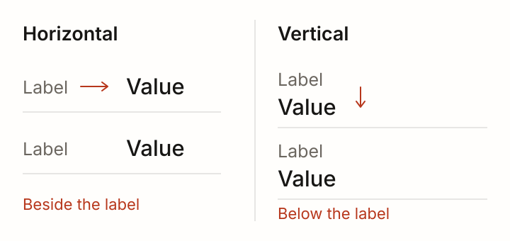
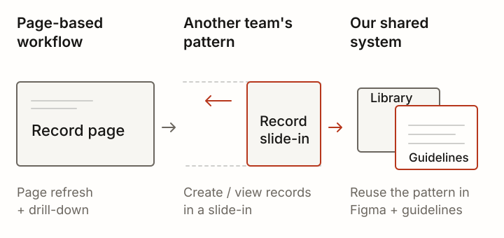

# Multi Product Integrations

Designers were repeating similar workflow decisions across separate apps. I helped define shared patterns, Figma libraries and a layout starter that teams could reuse.

## Why we needed common patterns

Across different places I've worked, I've seen designers solve similar problems in separate apps. Teams were defining their own workflows even where the interactions overlapped, and a lot of that work was duplicated. We wanted to define common patterns that teams could reuse. This story brings together that work, with a real-estate engagement as one example.

## What I worked on

I was a primary contributor to defining the workflow patterns and representing them in the system. In the real-estate engagement, I worked with three teammates. We each took on different parts of the patterns and iterated together. The definitions and libraries came out of our combined work, with my contribution focused on the workflow patterns and a layout starter for different problem spaces.

## The decisions we kept repeating

The work covered decisions designers make throughout an application: where close buttons belong, when to use a modal or drawer, and how to lay out information. We defined patterns for reading order, such as top to bottom and left to right, and for presenting labels and values horizontally or vertically.

Horizontal and vertical label/value pairs were among the patterns we defined.

## Learning from another team's record workflow

Some other apps had more sophisticated dashboards and rules for progressive disclosure. We found scenarios where their approach fit better than ours. We adopted the slide-in workflow for creating or viewing records and brought that pattern into our shared Figma libraries and guidelines.

We adopted another team's slide-in workflow and added the pattern to our shared Figma libraries and guidelines.

## Putting the patterns into Figma

We built Figma component libraries with guidelines for the patterns we had defined together. I also created a layout starter that designers could use when working on a different problem space. Across the pattern work, I worked with frontend developers to identify what we could and couldn't build. The frontend team implemented the code.

## How teams adopted it

The team agreed that a common system should be created, and the libraries were generally adopted across the projects I worked on. More established teams found it harder to adapt. We collaborated to identify scenarios where another team's process fit better than ours and brought those approaches into our system.
